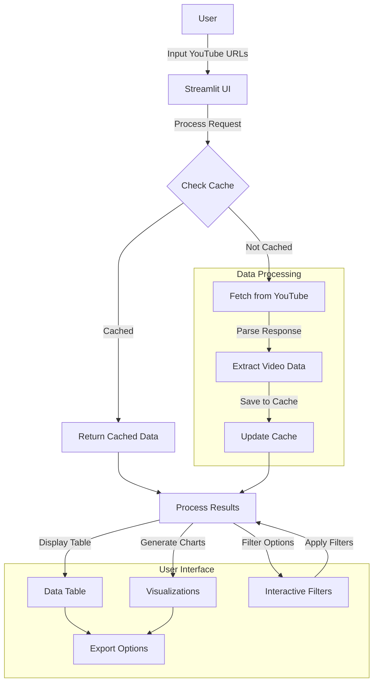

# YouTube Video Data Fetcher

A Streamlit application for fetching, analyzing, and visualizing data from multiple YouTube videos.

## Features

- **Bulk Processing**: Process multiple YouTube URLs simultaneously
- **Data Extraction**: Get comprehensive metadata for each video (title, views, duration, etc.)
- **Smart Caching**: Save previously fetched data to avoid redundant requests
- **Interactive Filtering**: Filter videos by channel, category, upload date, or keyword search
- **Rich Visualizations**: Analyze video performance with interactive charts and graphs
- **Export Options**: Download results as CSV or copy all URLs

[streamlit-app.webm](https://github.com/user-attachments/assets/612229d0-45ec-4e36-ba9e-a0154a105e8a)

[demo.webm](https://github.com/user-attachments/assets/05f164c2-d73d-4d81-94df-b67c3b6dbbb7)


## How It Works



## Installation

1. Clone this repository
2. Install required packages:
   ```
   uv venv --python 3.11
   source .venv/bin/activate
   uv pip install -r requirements.txt
   ```
3. Run the app:
   ```
   streamlit run app.py
   ```

## Usage

1. **Input YouTube URLs**:
   - Paste URLs directly (one per line)
   - Upload a text file containing URLs

2. **Configure Settings**:
   - Bypass cache (force refresh)
   - Adjust concurrent request limit

3. **Process Videos**:
   - Click "Process Videos" button
   - Progress bar will show processing status

4. **Explore Results**:
   - View video data in interactive table with thumbnails
   - Filter by channel, category, upload date, or search terms
   - Explore visualizations across different tabs
   - Export results as CSV or copy URLs

## Data Visualizations

The app provides four main visualization categories:

1. **Views Analysis**:
   - Distribution of view counts
   - Top videos by view count

2. **Duration Analysis**:
   - Distribution of video durations
   - Relationship between duration and views

3. **Uploads Timeline**:
   - Videos uploaded by month
   - Average views by upload month

4. **Channel Comparison**:
   - Number of videos per channel
   - Average views per channel

## Technical Details

- Built with Streamlit, Pandas, Plotly, and BeautifulSoup
- Uses concurrent processing for efficient data fetching
- Implements smart caching to minimize YouTube requests
- Extracts data from YouTube's internal API responses
- Renders interactive visualizations with Plotly Express
